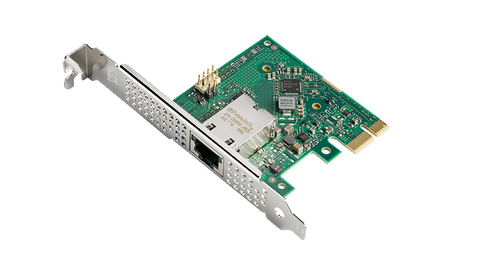
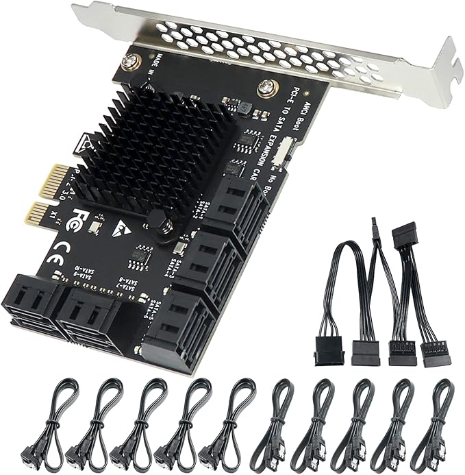
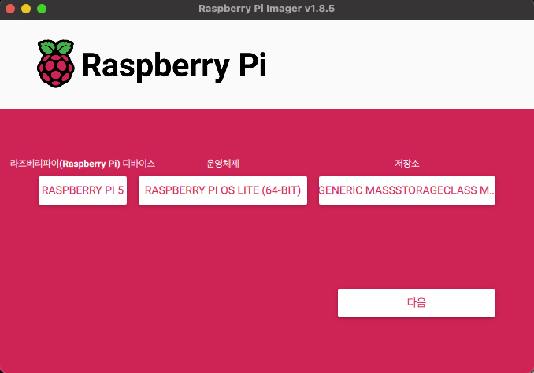
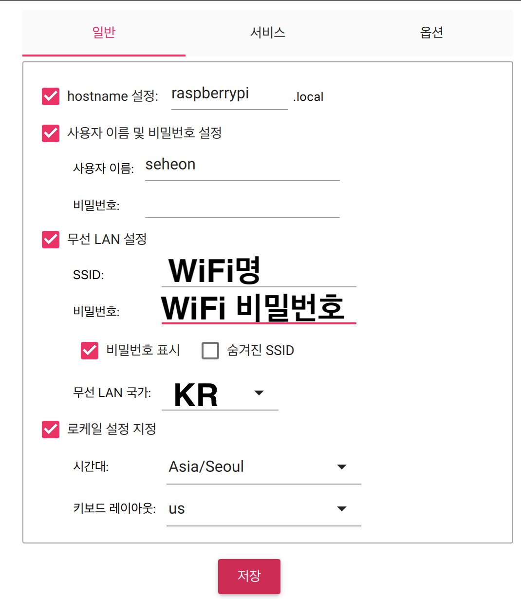

# 들어가며

---

## 학습 목표

### 왜?

- 그동안 개발 서버도 AWS, 운영 서버도 AWS…를 사용하면서 많은 돈을 기부했다. 개발 서버만이라도 간단하게 홈 서버를 올려 사용해보고자 학습을 시작했다.
- 그리고 리눅스 마스터가 되어보자!

### 준비물

- 안 쓰는 PC, 라즈베리 파이, 핸드폰.. 등등
    - `Raspberry Pi5` 의 경우 `USB`와 `USB - A 변환 이더넷 어댑터`가 필요함 (내장 이더넷 포트가 초기 부팅 시 비활성화됨).
    - 최신 `Raspberry Pi OS`와 `Proxmox`가 충돌할 수 있음.
    - `UEFI 펌웨어`를 사용하여 설치해야 함.
    - 내장 이더넷 포트는 `UEFI 부팅 단계에서 비활성화`되므로, 네트워크 연결을 위해 **USB 이더넷 어댑터**가 필요함.
- 나는 `Raspberry Pi5 8gb`를 사용했다. (주변 장비 사니까 미니 PC랑 비슷하게 들었다…)
- MSA같이 여러 서버를 돌릴 것을 예상하고 AWS 기준 t3.medium?보다 좀 더 나은 성능을 원했다.
- `Raspberry Pi5` 와 `Raspberry Pi 4` 에서 Proxmox 세팅 차이가 있으니 주의하자!

### 간단한 용어 정리

- Switch
    - OSI 2계층
    - `MAC 주소`를 기반으로 `네트워크 내`에서 데이터를 전송
- Router
    - OSI 3계층
    - `IP 주소`를 기반으로 `서로 다른 네트워크` 간에 데이터를 전달
- NIC Card (Network Interface Card)
    - 컴퓨터가 네트워크에 연결될 수 있도록 해주는 장치
    - NIC Card가 있어야 IP 주소와 MAC 주소를 가질 수 있음
- PCIE - 컴퓨터의 확장 슬롯으로, 그래픽 카드, SSD, 네트워크 카드 등을 연결하는 고속 인터페이스. 기존 PCI보다 대역폭이 넓고 빠름.
    - PCIE LAN CARD - PCIE 슬롯에 장착하는 네트워크 카드
    
    
    - PCIE SATA CARD - **SATA 포트를 확장**하는 PCIE 카드
    
    
    
- 컴퓨터의 **확장 슬롯**으로, 그래픽 카드, SSD, 네트워크 카드 등을 연결하는 고속 인터페이스
- 기존 PCI보다 대역폭이 넓고 빠름
- Network (Virtual Box 네트워크 설정)
    - NAT (Network Address Translation)
        - VM이 호스트의 인터넷을 공유
        - 외부에서 VM에 직접 접근 불가능
        - 원래 NAT라면 내부망 끼리는 같은 IP를 할당받기 때문에 VM끼리 소통 불가
    - Bridge
        - VM이 호스트와 동일한 네트워크를 사용 (IP도 동일 대역)
        - 외부에서 VM에 직접 접근 가능
        - VM끼리 소통 가능
    - HostOnly
        - VM과 호스트만 통신 가능
        - 인터넷 연결 X
- DHCP (Dynamic Host Configuration Protocol)
    - 자동으로 IP를 할당하거나 수동으로 고정 IP를 설정할 수 있음
    - DHCP는 **UDP 67번(서버) / UDP 68번(클라이언트)** 포트
    - **클라이언트(VM 등)가 먼저 요청하면 DHCP 서버가 IP를 할당**
    - 공유기
    - 고정 IP
    - VM 2대 (DHCP 서버, IP 할당받는 VM)
    - ISP (Internet Service Provider)
        - 인터넷 제공 업체. IP 할당, DNS 제공..
        - KT, U+, SKT..

### PROXMOX란?

- 일반적인 Ubuntu 환경과 비교했을 때 가상화 및 컨테이너 관리를 훨씬 효율적으로 할 수 있기 때문.
- VM 생성 시 default 네트워크 모드는 Bridge
- `Linux Bond`
    - 여러 `네트워크 포트`를 `하나로` 묶어 속도를 높임.  하나 고장나도 다른 랜으로 가능.

# 실습

---

## Raspberry Pi 5

---

[Pimox8로 설치하기](https://tricknology.in/how-install-proxmox-on-your-raspberry-pi-in-7-minutes-step-by-step/)

해당 방식을 진행할 때 raspberrypi의 내장 이더넷 포트가 아닌 USB - A 타입 이더넷 포트를 사용해야 한다!!

raspberrypi에 proxmox 설치 과정에서 NIC 카드 자체가 죽는다. 설치 후에는 내장 이더넷 포트를 사용해도 괜찮다. 

|  |  |
|:-------------------------:|:-------------------------:|

## Raspberry Pi 4

---

### 라즈베리파이 이미지

- 아래 사이트에서 다운
- https://www.raspberrypi.com/software/
- 서비스와 옵션 설정은 그대로.

- 라즈베리파이를 띄운 후
- [Angry IP Scanner](https://angryip.org/)로 라즈베리 파이의 IP를 잡아서 접속하면 된다.
- 이후 과정은 아래 유튜브 참고

[GitHub - pimox/pimox7: Proxmox V7 for Raspberry Pi](https://github.com/pimox/pimox7)

https://www.youtube.com/watch?v=-hT231RiHMY
