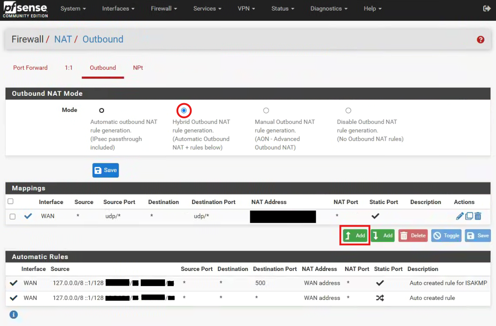
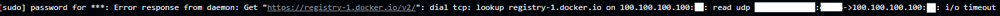
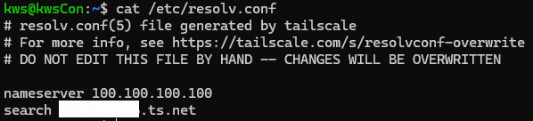
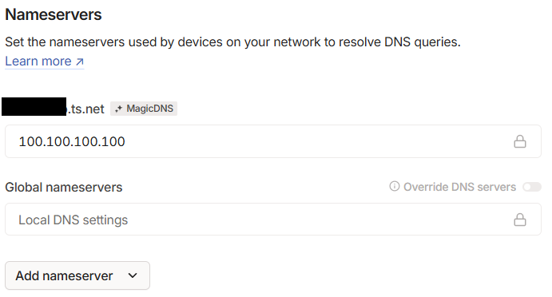
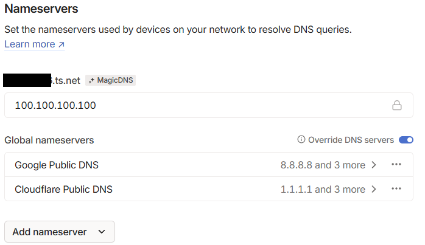

# 홈랩 스터디 2주차

## 실습할 내용

1. ✅ SSH 구성하기
2. ✅ Tailscale VPN 설치하고 Tailscale SSH 사용하기
3. ✅ Docker 설치하기
4. ✅ 머신/네트워크 상태 확인하기
5. ✅ Tailscale VPN의 DNS를 사용해서 서비스 접속하기

## 새롭게 배운 것

### SSH 구성 방법

#### 일반적인 SSH 구성 흐름
```bash
ssh-keygen
ssh-copy-id user@hostname
ssh user@hostname
```

#### GitHub의 Public Key를 사용하는 방식
1. GitHub에 공개키(`~/.ssh/id_rsa.pub`) 등록
2. 서버에서 GitHub의 공개키를 curl로 가져오기:
```bash
curl https://github.com/<github-username>.keys >> ~/.ssh/authorized_keys
```
3. SSH 재시작:
```bash
sudo systemctl restart sshd
```

- GUI 없이 구성 가능, 자동화에도 유리함.

---

### Tailscale VPN 및 SSH

- Tailscale Auth Key 사용 시:
  - GUI 없이 CLI로만 구성 가능 → 자동화 가능
  - Tailscale 계정 공유 없이도 접속 설정 가능

- Tailscale SSH 사용
  - `tailscale ssh user@hostname` 으로 접속
  - *다른 사람이 내 머신에 tailscale ssh 접속하도록 허용하려면?*
    - Tailscale ACL 설정에서 `ssh` 허용 규칙 추가 필요
    - 예: `"ssh": ["autogroup:admin"]`

---

### Docker 설치하기

- 공식 설치 방법:
```bash
curl -fsSL https://get.docker.com | sh
```

- 설치 후 현재 유저를 docker 그룹에 추가:
```bash
sudo usermod -aG docker $USER
```

- ARM 기기의 경우:
  - 최근 버그가 많아 안정적인 버전 명시 필요
  - `moby`나 [Mirantis Container Runtime (doc.mirantis.com)](https://docs.mirantis.com/) 확인
  - Docker에는 LTS 개념이 없어 안정성 확보 필요

---

### 머신/네트워크 상태 확인 팁

- 머신이나 네트워크가 죽었을 경우 자동 복구를 위해 `cron` 사용:
```bash
sudo crontab -e
```
- crontab 문법 확인: [crontab.guru](https://crontab.guru)

- `systemctl` 로그를 길게 보고 싶다면:
```bash
sudo journalctl -u <서비스명>
```

---

### Tailscale VPN의 DNS 사용

- Tailscale은 자체 DNS를 제공하므로, 서비스 접속 시 `http://<기기이름>:포트` 로 접근 가능
- FQDN 사용 시:
  ```bash
  http://<기기이름>.<tailscaleDNS도메인>:포트
  ```

- Docker로 Nginx 띄운 후에도 tailscale DNS로 접속 가능 → 로컬 환경 개발에 유용

## 문제 상황

### ✅ Tailscale VPN의 설치에는 성공했으나 Tailscale SSH 접속이 되지 않음

#### 문제가 발생한 환경

- 설치하려는 기기를 서버, 이미 설치가 되어 잘 작동하는 기기를 클라이언트로 통칭
- 서버와 클라이언트 모두 각각 pfsense 방화벽 하위의 LAN에 위치하며 두 pfsense의 release version이 상이함

#### 문제

- tailscale vpn을 설치 완료한 서버에서 `sudo systemctl status tailscaled` 명령어 입력 시 `Failed to send handshake response: no UDP or DERP addr` 로그가 나타남
- 클라이언트에서 `tailscale status` 명령어를 실행시킨 결과, `DERP hkg Relay` 를 포함한, 아무튼 비정상적인 상태로 조회됨
- tailscale ssh를 사용해 ssh 접속은 불가하지만 `tailscale ping` 명령어를 사용해 ping은 보내지는 상황
- `tailscale up --ssh --reset` 명령어 입력 시 web console에서 ssh 접근이 가능하다 나타나지만, 클라이언트에서 tailscale ssh를 사용해 ssh 접속이 불가능함

#### 해결 방법

- 한줄요약: 방화벽 설정 변경 이후 재설치로 해결
- `DERP hkg Relay` 를 포함한 상태를 해석해본다면, 홍콩(hkg)에 위치한 DERP 서버에 직접 연결하지 못하고 relay 모드가 실행되어 있는 상태
    - DERP(Designated Encrypted Relay for Packets) 서버: tailnet device를 연결하기 위해서는 중개자 역할을 맡는 서버가 필요함. [DERP servers](https://tailscale.com/kb/1232/derp-servers)
    - `tailscale netcheck` 명령어를 실행해 tailscale vpn을 실행시키기 위한 IPv4, UDP 상태, DERP latency 등에 대한 report를 조회 가능함함
- pfsense 환경에서 실행이 안되는 이슈가 이미 존재하였으며 공식 홈페이지에 [해결방법](https://tailscale.com/kb/1146/pfsense)이 존재함 
    - LAN 환경에서 hard NAT가 구성되어 있는 환경의 경우 DERP server에 direct connection 생성이 어려울 수 있음
    - `tailscale up --anat-subnet-routes=true`가 default이기 때문에 `false`로 변경하면 LAN 환경에서 발생하는 문제를 해결할 수 있다고 함함. [참고](https://github.com/tailscale/tailscale/issues/6874) ~~난 실패했음~~
    - 방법1: 아래 이미지와 같이 NAT Outbound Rule 설정 이후 tailscale ACL에 다음 구문 추가
    ```json
    {
         // ACLs and other configurations
        "randomizeClientPort": true
    }
    ```
    
    <p align="center">
        
    </p>
    
    <p align="center">
        
    </p>

    - 방법2: tailscale VPN을 작동시키고자 하는 디바이스가 위치한 LAN interface에 NAT-PMP 설정

    <p align="center">
        
    </p>

    - 방법1 또는 방법2 진행 이후 **반드시 재설치** ~~재설치 안하고 왜 안되지 하고있었음~~

- ✅ **해결 완료!**

### ✅ Tailscale VPN 설치 이후 Docker registry에서 pull이 불가능한 문제 발견

#### 문제

- tailscale VPN 설치 이후 갑작스럽게 잘 작동하던 github action의 배포 workflow에서 `docker pull image` 명령어를 수행하지 못하는 문제가 발생

<p align="center">
    
</p>

- `ping github.com`은 정상적으로 작동하나 `ping registry-1.docker.io` 명령어 실행 시 loss 100%가 발생함을 확인하였음
- tailscale을 설치하면서 기존의 DNS가 tailscale의 magic dns로 변경되며 발생한 문제로 판단하였음

<p align="center">
    
</p>

#### 해결 방법

- tailscale의 기본 DNS 설정은 다음 이미지와 같음

<p align="center">
    
</p>

- tailscale의 DNS 설정중 `override DNS servers` 토글을 활성화한 후 다음과 같이 nameserver를 추가

<p align="center">
    
</p>

- ✅ **해결 완료!**

#### 의문점

- ChatGPT에 의하면 `tailscale up --accept-dns=false --reset` 명령어를 실행시키고 `/etc/resolv.conf` 를 편집하면 해결이 가능하다고 하였으나 실패하였음
