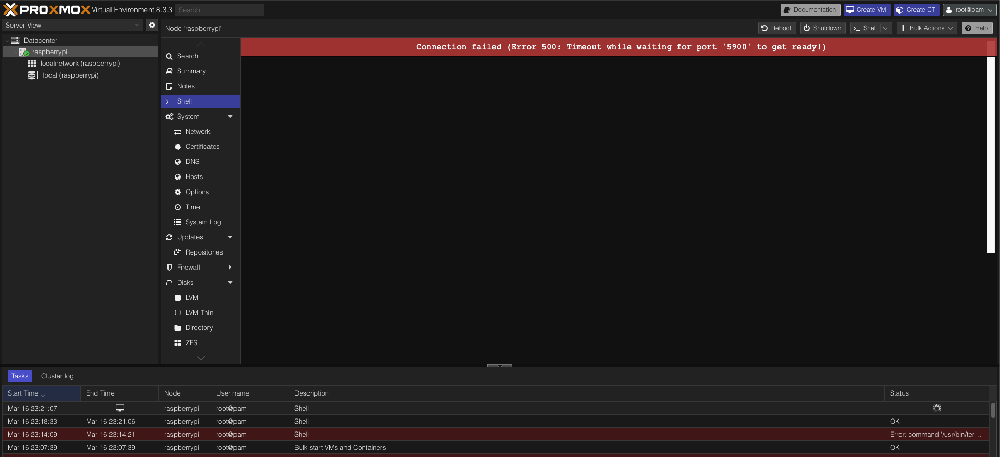
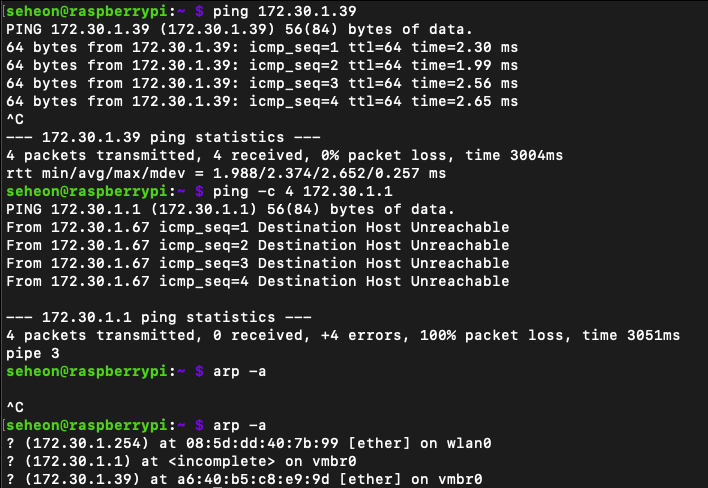

# Tailscale 설정 및 Github Actions Runner
# 들어가며

---

## 학습 목표

### Tailscale이란?

- VPN을 쉽게 설정할 수 있도록 도와주는 네트워크 도구

### 왜?
- TailScale
  - **포트포워딩 없이도** 내부 네트워크에 안전하게 접속 가능
  - **손쉬운 VPN 구성**으로 복잡한 네트워크 설정 없이 사용 가능
  - **보안 그룹 구성**을 통해 안전한 네트워크 환경 유지

# 실습

---

## Connection failed (Error 500: Timeout while waiting for port '5900' to get ready!)



Tailscale을 진행하려 했으나 Proxmox Shell에 이상한 게 떠있다…

### 해결 방법

- 해결 방법은 간단하다. 라즈베리파이에 ssh로 접속하여 아래 명령어 입력하면 된다.

```bash
sudo nano /etc/hosts

### 추가 ###
127.0.0.1 localhost.localdomain localhost
### ### ###
```

- 호스트명 해석 (DNS resolution) 문제로 Proxmox의 termproxy 서비스가 localhost를 찾지 못하여 생기는 문제라고 한다.
> termproxy : Proxmox의  웹 기반 터미널 서비스. 내부적으로 `localhost` 주소를 통해 콘솔 세션을 생성하므로 DNS 해석 문제로 `localhost`를 인식하지 못하면 연결 실패.
- `/etc/hosts`에 `127.0.0.1 localhost.localdomain localhost` 가 없거나 호스트명이 바뀌었을 경우 생긴다고 한다.

## sudo apt update & apt upgrade -y 문제

- 업데이트가 되지 않아 ping 테스트를 진행했다.
- mac(local)로는 잘 보내지지만 Gateway로 나가질 못한다. `arp -a` 명령을 보면 `L2(이더넷)` 레벨에서 통신이 안 됨을 확인할 수 있다.
- 인터넷은 되는데 Gateway로 핑이 안 보내진다 ?
    - 172.1.1.1이 Gateway가 아닐 확률이 높다!!
    - mac에서 확인해본 결과 역시나 Gateway가 달랐다. 해당 Gateway로 변경해서 등록하니 해결되었다.
    
    ```bash
    # 현재 Gateway 확인
    ip route
    # 인터페이스 상태 확인
    ip link show
    # 인터페이스에 할당된 IP 확인
    ip addr show
    
    # 중복된 Gateway 삭제
    sudo ip route del default via 172.30.1.1 dev vmbr0
    
    ```
    

## Tailscale 다운로드

- Proxmox 쉘에서 진행하면 된다.

```bash
sudo -s

apt update && apt upgrade -y

curl -fsSL https://tailscale.com/install.sh | sh

# Tailscale 활성화 및 장치 연결 시작
tailscale up

# 위 명령어를 실행하면 Tailscale 로그인 링크가 제공됨
# 예: https://login.tailscale.com/a/...
# 해당 링크로 접속하여 로그인하면 네트워크에 연결됨

# 현재 장치의 Tailscale IPv4 주소 확인
tailscale ip -4

# Tailscale 서비스가 부팅 시 자동 시작되도록 설정
systemctl enable tailscaled

# (필요 시) 방화벽 정책이 restrictive한 경우, Tailscale 및 SSH 포트 수동 허용
# Tailscale 기본 UDP 포트(41641) 허용
iptables -A INPUT -p udp --dport 41641 -j ACCEPT
# Tailscale이 WireGuard 기반으로 사용하는 UDP 포트(51820) 허용
iptables -A INPUT -p udp --dport 51820 -j ACCEPT
# SSH 접속을 위해 TCP 포트(22) 허용
iptables -A INPUT -p tcp --dport 22 -j ACCEPT
```

- `iptables -A INPUT -p udp --dport 41641 -j ACCEPT`
    - Tailscale이 피어 간 통신을 위해 사용하는 기본 포트(41641)를 허용한다.
    - 보통 `NAT 트래버설 기능` 덕분에 필요하지 않지만, 특정 환경(예: 엄격한 방화벽)에서는 필요할 수도 있다.
        - `NAT 트래버설 기능` : NAT 내에서 장치 간 P2P(직접 통신)이 가능하게 함.
- `iptables -A INPUT -p udp --dport 51820 -j ACCEPT`
    - Tailscale은 `WireGuard` 프로토콜을 기반으로 동작하며, 기본적으로 UDP 51820 포트를 사용
        - `WireGuard` : Tailscale에서 사용하는 VPN
    - 일부 환경에서는 이 포트도 허용해야 정상적으로 연결된다고 한다.
- `iptables -A INPUT -p tcp --dport 22 -j ACCEPT`
    - SSH(보통 원격 서버 관리 시 사용)를 위해 TCP 22번 포트를 허용한다.
