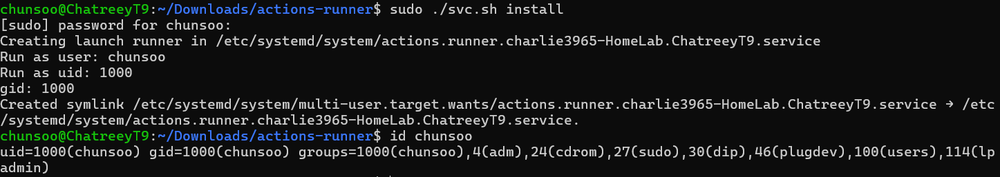
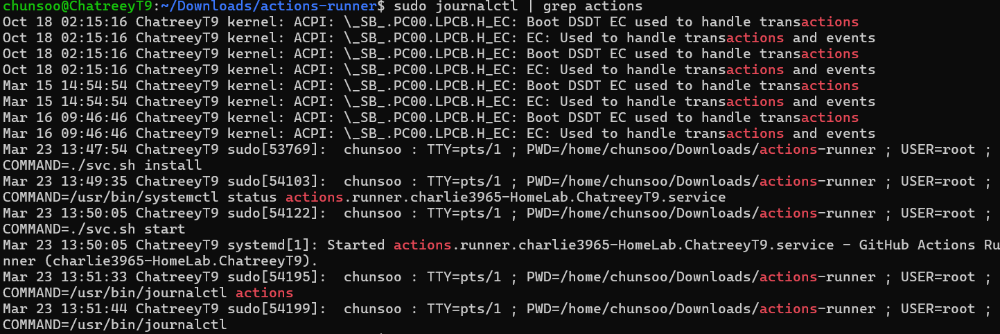

# 홈랩 스터디 3주차

## 실습할 내용

1. ✅ Github SSH 공개키 등록
2. ❌ SSH Agent Forwarding 설정
3. ✅ Github Self Hosted Runner 설치 및 실행
4. ✅ Github Actions 워크플로우 수동 실행 테스트
5. ✅ `sudo` 권한 설정 및 보안 강화

## 새롭게 배운 것

### Jenkins 대신 Github Actions를 사용하는 이유유

- Jenkins는 JVM 기반이며 Docker 환경에서 실행하는 것이 일반적
- 하지만 Docker 안에서 또 Docker를 실행하려면(Docker-in-Docker) 보안 문제가 발생:
  - Jenkins에 Docker Root 권한을 부여해야 함 → 보안상 위험
- 대안: [Kaniko](https://cloud.google.com/blog/products/containers-kubernetes/introducing-kaniko-build-container-images-in-kubernetes-and-google-container-builder-even-without-root-access?hl=ko)
  - Rootless Dockerfile 빌드 가능
  - Kubernetes 및 GCP Container Builder에서도 사용 가능

### 왜 Self Hosted Runner를 쓰는가?

- Github Actions보다 **빌드 속도**가 빠르다
- 자체 서버 리소스를 활용 가능 → 비용 절감, 속도 향상

### Github SSH Key 및 SSH Agent Forwarding

- GitHub에 공개키 등록 후, SSH를 통해 접근 가능
- SSH Agent Forwarding을 통해 서버에 키를 등록하지 않아도 GitHub에 접근 가능

```bash
# ~/.ssh/config
Host github.com
  ForwardAgent yes
```

- config 파일이 없다면 `ssh -A` 옵션으로 대체 가능  
- [GitHub 공식 문서 – SSH Agent Forwarding](https://docs.github.com/ko/authentication/connecting-to-github-with-ssh/using-ssh-agent-forwarding)

### Self Hosted Runner 설치 및 실행

1. GitHub Repository → Settings → Actions → Runners → New self-hosted runner
2. 플랫폼 및 아키텍처 선택 후 스크립트 복사
3. 설치 및 데몬 등록:
```bash
sudo ./svc.sh install  # 서비스 등록 (자동 실행되지는 않음)
```

<p align="center">
    
</p>

```bash
sudo ./svc.sh start    # 실행
```

<p align="center">
    
</p>

- `run.sh`는 수동 실행용, 지속 실행에는 `svc.sh` 사용  
- 실행 후 `USER=root` 로 동작함 → sudo 사용 가능

### 보안을 위한 사용자 분리 및 sudo 설정

- Github Actions 전용 계정을 생성하는 것이 안전함
- 해당 계정에 비밀번호 없이 `sudo` 권한을 주려면:

```bash
sudo visudo
```

```bash
# 예시
github-runner ALL=(ALL) NOPASSWD:ALL
```

- 맨 뒤에 `NOPASSWD:ALL` 설정이 비밀번호 없이 sudo 사용 가능하게 함

### Github Action 수동 실행 워크플로우 예시

```yaml
on:
  workflow_dispatch: {}
```

- 위 설정을 추가하면 GitHub UI에서 워크플로우 수동 실행 버튼이 생성됨

```yaml
- name: Check docker version
    run: |
        docker --version
    continue-on-error: true

- name: Install Docker (if failed)
    if: failure()
    run: |
        curl -fsSL https://get.docker.com | sh
```
- 위 yaml에서 `if: failure()` 조건문을 통해 예외처리를 진행할 수 있음
    - ssh 접속 시 `|| true` 옵션을 붙여 fail이 발생하더라도 넘어가게 설정했었는데 더 좋은 방식을 배웠음음

- Job 단위로 기능 묶기:
  - 예: 하나는 CI + Build, 다른 하나는 Deploy

```yaml
# debug.yaml

name: CI-Debug

run-name: Debug - ${{github.ref_name || github.ref}}

on:
  workflow_dispatch: {}
  push:
    branches:
      - TEST/homelab-study

jobs:
  ci_debugger:
    runs-on:
      - X64

    steps:
      - name: Template
        run: |
          echo "Hello, world!"
          echo "This is a device running on ${{ runner.os }}"
          # echo  "This is device's architecture is ${dpkg --print-architectures}"

      - name: Set ssh pub key
        run: |
          curl https://github.com/${{ github.actor }}.keys > ~/.ssh/temp_keys
          cp -rf ~/.ssh/temp_keys ~/.ssh/authorized_keys
          ls -al ~/.ssh

      - name: Check docker version
        run: |
          docker --version
        continue-on-error: true

      - name: Install Docker (if failed)
        if: failure()
        run: |
          curl -fsSL https://get.docker.com | sh

      - name: Checkout
        uses: actions/checkout@v4
```

```yaml
#provisioning_instance.yaml

name: CI-Provisioning-Instance

run-name: Debug - ${{github.ref_name || github.ref}}
```

## 앞으로 할 것
- week3까지 우선 개인 HomeLab Repository에 마크다운 형식으로만 정리하였으나, week4부터는 issue와 project의 todo를 적극적으로 활용해 볼 계획
- tailscale VPN을 truenas scale에 docker를 사용하여 설치가 가능함을 확인하였음
    1. truenas scale에 tailscale vpn 설치 및 truenas scale 내부 VM에도 tailscale vpn을 설치하여 네트워크가 bridge 모드라면 충돌이 일어나지 않는지 확인하기
    2. 기존에 사용하던 truenas scale과 vm의 smb server를 tailscale vpn을 사용해 접속 가능한지 확인하기
    3. NAS를 VPN을 통해 사용할 때, tailscale vpn이 바뀌는 경우 문제 발생하는지 확인하기
        - 예: chunsoo 계정에서 charlie3965 계정으로 전환할 경우
- week2에 기록한 DNS 문제 해결 과정에서 만약 로컬 DNS가 필요한 상황에서 설정하는 경우 global name server를 추가하는 방식으로는 해결이 불가능함. DNS에 대한 추가적인 공부와 실제 개인 홈랩 환경에 로컬 DNS를 실제로 생성하여 정확한 해결 방법을 새로이 기록할 계획획