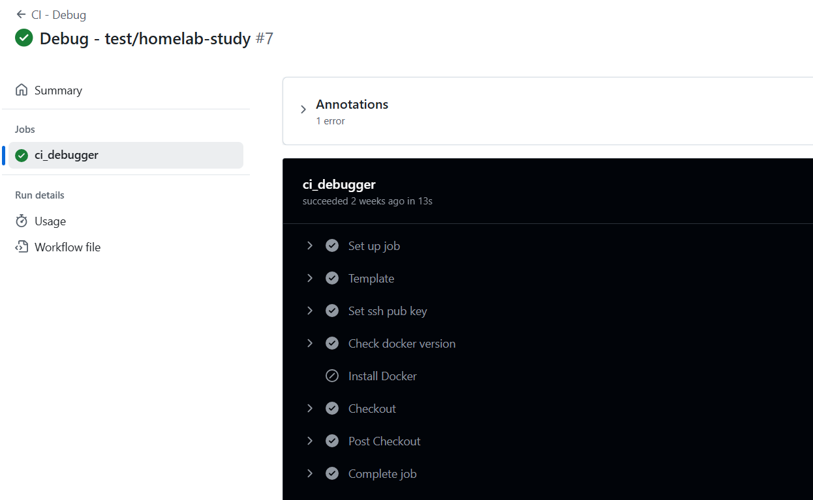

# # Title : Github SSH, Self Hosted Runner, Github Actions

## 1. What is this?

### 1. Github Actions
Github Actions : CI/CD 도구, 코드 변경 사항을 감지하고 자동으로 빌드, 테스트, 배포 등을 수행할 수 있도록 하는 역할. YAML 형식의 워크플로우 파일을 통해 작업을 정의할 수 있습니다. Jenkins와 다르게 Github 내부 자체에 속해 있기 때문에 별도의 환경 구축이 필요하지 않습니다.

Github Actions VS Jenkins

이전 프로젝트에서 CI/CD 도구로 Jenkins를 사용한 경험이 있었는데, 마침 Github Actions를 써볼 기회가 생기고 정리하는 김에 한번 이 둘을 비교해보았습니다.

Jenkins:

복잡한 CI/CD 워크플로우가 필요한 경우
높은 수준의 사용자 정의 및 제어가 필요한 경우
온프레미스 환경에서 CI/CD를 구축해야 하는 경우
Jenkins에 대한 경험이 풍부한 팀이 있는 경우

GitHub Actions:
간단하고 빠르게 CI/CD 파이프라인을 구축하고 싶은 경우
서버 관리에 대한 부담을 줄이고 싶은 경우
GitHub 리포지토리를 사용하는 프로젝트
개인 프로젝트 또는 소규모 팀

추가적으로 실제 구축을 직접해야하는 Jenkins의 경우에는 dind(Docker-in-Docker)문제, Agent의 Docker 권한 부여 등의 문제들이 있어서 Jenkins의 진정한 장점을 이용하지 않는다면 서버에 직접 구축하는 시간 및 서버 자체에 구축했을때 드는 추가적 비용의 이유로 개인적으로 Github Actions를 더 선호할 것 같다. 

### 2. Self Hosted Runner
GitHub Actions는 기본적으로 GitHub에서 제공하는 클라우드 기반의 러너 (GitHub-Hosted Runner)를 사용하여 워크플로우를 실행합니다. 하지만, 특정 요구 사항 (특정 OS, 특정 하드웨어, 내부 네트워크 접근 등) 때문에 GitHub에서 제공하는 러너를 사용할 수 없는 경우, 사용자가 직접 러너를 구성하고 GitHub Actions에 연결하여 사용할 수 있습니다. 이러한 러너를 Self-Hosted Runner라고 합니다.

### 3. Github SSH
GitHub SSH는 GitHub에 안전하게 접근하기 위한 방법 중 하나입니다. SSH 프로토콜을 사용하여 GitHub 리포지토리에 접근하고, 데이터를 주고받을 수 있습니다.

## 2. Let's practice

### 1. Github SSH 설정

- SSH 키 생성 단계: 사용자는 자신의 컴퓨터에서 SSH 키 쌍 (개인 키, 공개 키)을 생성합니다.
- 공개 키 등록 단계 : 생성된 공개 키를 GitHub 계정에 등록합니다.
- SSH 연결 단계 : 사용자는 SSH 프로토콜을 사용하여 GitHub 리포지토리에 접근합니다.
- 인증 단계 : GitHub는 사용자의 개인 키와 등록된 공개 키를 비교하여 사용자를 인증합니다.

github.com/(자신의 프로필 이름).keys 에 접속을 하면
공개 키가 등록된 걸 확인 할 수 있다.

### 2. Self Hosted Runner

- GitHub Repository → Settings → Actions → Runners → New self-hosted runner 접속
- 접속한 곳의 스크립트를 복사하여 자신의 서버(VM)에 설치

```bash
sudo ./svc.sh install
sudo ./svc.sh start
```

### 3. Actions Script Write

```YAML
name: CI - Debug

run-name: Debug - ${{ github.ref_name || github.ref}}

on:
  workflow_dispatch: {}
  push:
    branches:
      - test/homelab-study

jobs:
  ci_debugger:
    runs-on:
      - master

    steps:
      - name: Template
        run: |
          echo "Hello, world!"
          echo " This is device running ${{ runner.os }}!"
          echo "architecture is $(dpkg --print-architecture)"

      - name: Set ssh pub key
        run: |
          curl https://github.com/${{ github.actor }}.keys > ~/.ssh/temp_keys
          cat ~/.ssh/temp_keys
          cp -rf ~/.ssh/temp_keys ~/.ssh/authorized_keys
          ls -al ~/.ssh

      - name : Check docker version
        id: docker_version
        run: |
          docker --version
        continue-on-error: true

      - name : Installing Docker 
        #if: failure()
        run: |
          curl -fsSL https://get.docker.com | sh
          docker --version

      - name: Checkout
        uses: actions/checkout@v4
```


#### Github Actions Workflow
아래는 Self-Hosted Runner를 활용한 Github Actions Workflow 예제입니다:

```yaml
name: Debug Workflow

on:
  workflow_dispatch:
    inputs:
      branch:
        description: 'Branch name'
        required: true
        default: 'main'
  push:
    branches:
      - 'week/#3'
      - 'main'

jobs:
  CI_debug:
    runs-on: self-hosted
    steps:
      - name: Template
        run: |
          echo "Hello, World!"
          echo "This is a device running on ${{ runner.os }}"
          echo "This is a device running on ${{ runner.arch }}"
          echo "This device's architecture is $(dpkg --print-architecture)"
      
      - name: Check Docker version
        id: docker_version
        run: |
          docker --version
        continue-on-error: true
      
      - name: Install Docker (if failed)
        run: |
          curl -fsSL https://get.docker.com | sh
      
      - name: Checkout
        uses: actions/checkout@v2
```

### 4. Conclusion

실제 Runner 가 동작하는 워크플로우를 확인.




On-promise 환경이 궁금해서 시작한 HomeLab 스터디 였기 때문에 이번에 배운 Self-Hosted-Runner 자체에 흥미가 매우 높았다. 마지막으로 On-promise 환경에서 Self-Hosted Runner가 어떤식으로 유용하게 쓰이는지 LLM을 통해 정리해보았다.

Self-Hosted Runner가 온프레미스 환경에서 유용한 이유

내부 네트워크 접근: Self-Hosted Runner는 온프레미스 환경의 내부 네트워크에 접근할 수 있습니다. 따라서, 내부 API 서버, 데이터베이스, 파일 서버 등에 접근해야 하는 CI/CD 파이프라인을 구축할 수 있습니다. GitHub에서 제공하는 클라우드 기반 러너는 내부 네트워크에 접근할 수 없기 때문에, Self-Hosted Runner가 필수적입니다.

보안: Self-Hosted Runner는 온프레미스 환경 내에서 운영되므로, 기업의 보안 정책을 준수할 수 있습니다. GitHub에서 제공하는 클라우드 기반 러너는 기업의 보안 정책을 준수하기 어려울 수 있습니다.

레거시 시스템 지원: Self-Hosted Runner는 사용자가 원하는 OS, 소프트웨어, 라이브러리 등을 자유롭게 구성할 수 있습니다. 따라서, 오래된 시스템이나 특정 소프트웨어 버전을 필요로 하는 CI/CD 파이프라인을 구축할 수 있습니다.

특정 하드웨어 활용: Self-Hosted Runner는 사용자가 원하는 하드웨어 (예: GPU)를 사용할 수 있습니다. 따라서, GPU를 사용하여 머신러닝 모델을 학습하거나, 고성능 컴퓨팅 작업을 수행하는 CI/CD 파이프라인을 구축할 수 있습니다.

데이터 지역성: 데이터가 특정 지역에 저장