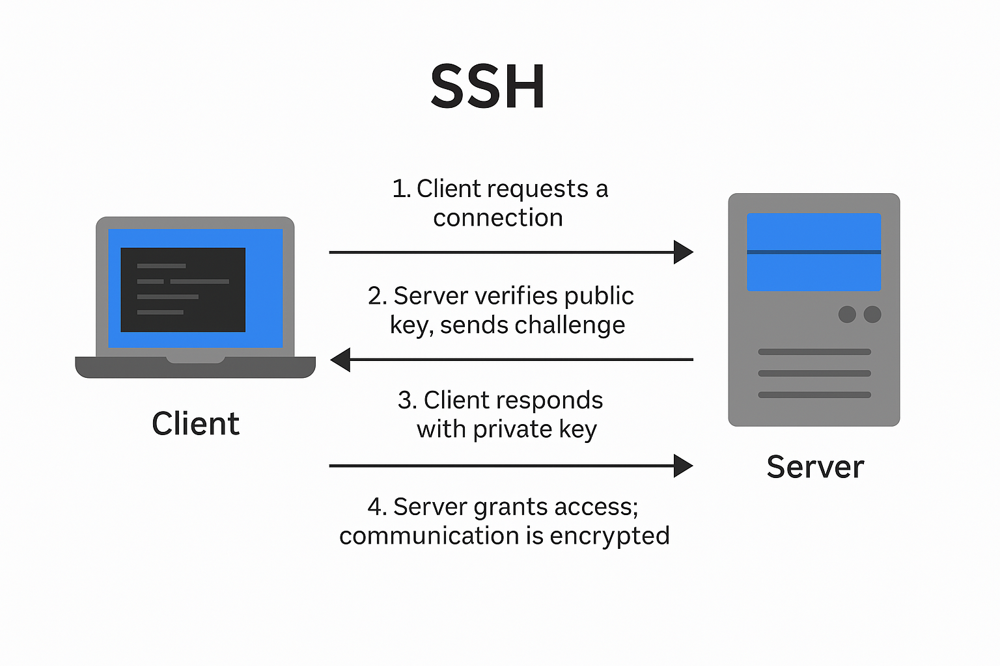

# Tailscale 설정 및 Github Actions Runner
# 들어가며

---

## 학습 목표

### 왜?
- Github Actions Runner
  - Jekins 대신 Github Actions를 사용해야!
      - `Jenkins`에서 Docker를 쓰려면 보통 `Docker in Docker(DinD)` 설정이 필요
      - **Docker로 Jenkins를 컨테이너로 띄움**
      - **그 Jenkins 컨테이너에서 또 다른 Docker 컨테이너를 실행하고 싶음** → CI 과정 중에 Docker 빌드/배포 등
      - 이를 위해 **호스트의 Docker 소켓(`/var/run/docker.sock`)을 Jenkins 컨테이너에 mount**함 → Jenkins 컨테이너가 **호스트의 Docker 데몬에 직접 접근**하게 됨
      - 이로 인해 Jenkins 컨테이너가 **호스트의 Docker를 조작할 수 있고, 결과적으로 `root 권한`까지 탈취 가능** → `컨테이너 탈출`로 이어질 수 있음
  - 보안을 위해 Kaniko 등 대안을 쓰면 **설정이 복잡하고 운영 부담 증가**
  - Jenkins는 **서버 설치·플러그인 관리 등 환경 설정이 무거움**

### 용어 정리
- ssh
    - 인터넷을 통해 `원격 컴퓨터`에 안전하게 접속하고 명령어를 실행하거나 파일을 전송할 수 있게 해주는 `암호화된 통신 프로토콜`
- ssh 동작 과정
    - 클라이언트가 서버에 접속 요청
    - 서버는 `공개키` 확인, 있다면 `challenge` 전송
    - 클라이언트가 개인키로 복호화하여 challenge에 대한 응답
    - 서버가 응답 검증 → 접속 허용
    - 이후 통신은 모두 암호화
    
    > Challenge
    ”너 진짜 그 키 가지고 있음?”
    `서버`가 `클라이언트`에게 보내는 암호화된 데이터로 `클라이언트`는 자신의 `개인키`로만 복호화 할 수 있음
    > 
    
    
    
- Apple - Zero Trust
    - 모든 접근을 검증하고 최소 권한만 부여
    - 만든 기업 조차도 아무도 신뢰하지 않음

# 실습

---

## Github Action Runner
## Secretive

- **macOS에서 SSH 키를 안전하게 관리**할 수 있도록 도와주는 도구
- [링크](https://github.com/maxgoedjen/secretive)

```bash
# .ssh/config
# local -> proxmox -> vm 2번의 hop
Host *
  IdentityAgent {secretive pub key}

Host proxmox
  HostName {tailscale ip}
  User seheon

Host proxmox-ubuntu 
  HostName {vm ip}
  User seheon
  ProxyJump proxmox
```

## Github Actions

```bash
# ./github/workflows
name: Debug Workflow

on:
  workflow_dispatch:
    inputs:
      branch:
        description: 'Branch name'
        required: true
        default: 'main'
  push:
    branches:
      - 'week/#3'
      - 'main'

jobs:
  CI_debug:
    runs-on: self-hosted
    steps:
      - name: Template
        run: |
          echo "Hello, World!"
          echo "This is a device running on ${{ runner.os }}"
          echo "This is a device running on ${{ runner.arch }}"
          echo "This device's architecture is $(dpkg --print-architecture)"
      
      - name: Check Docker version
        id: docker_version
        run: |
          docker --version
        continue-on-error: true
      
      - name: Install Docker (if failed)
        run: |
          curl -fsSL https://get.docker.com | sh
      
      - name: Checkout
        uses: actions/checkout@v2
```