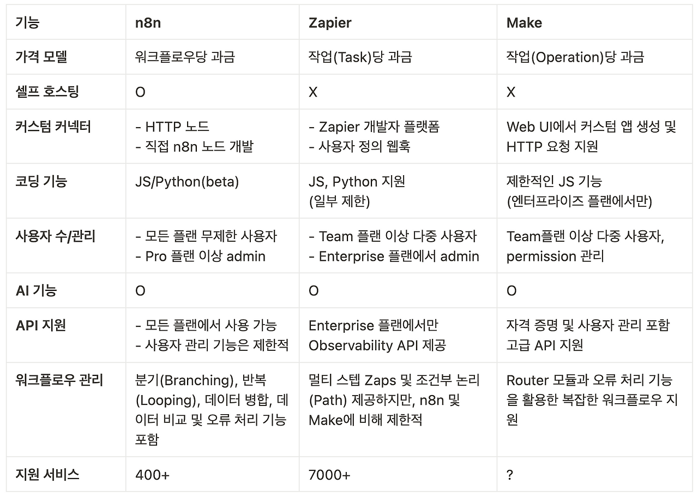
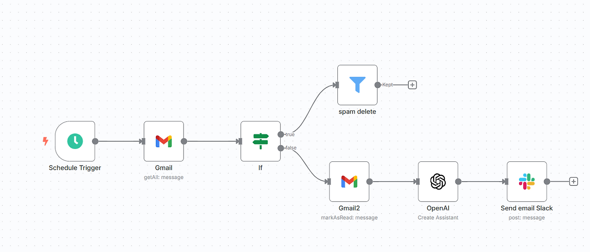

# Title : n8n, n8n workflow

요즘 클라우드, DevOps 등의 직무에서 가장 중요하게 생각하는 키워드가 바로 "자동화"라고 생각합니다. 하지만 회사를 다니지 않는 저에게 자동화가 왜 중요한지? 어떤 효율을 높히는지 잘 모르기 때문에 간단한 "예시"로 설명을 하자면

매일마다 해야하는 일 -> 계획 작성, 코딩테스트

이런 일을 매일 마다 해야하고 매일 직접 작성 및 풀이를 해야하는 상황에서

매일 정해진 시간마다 계획표 작성 알람 및 초안 작성, 코딩테스트 추천 문제 전달 등의 기능이 있다면

매일 쌓이면서 얼마나 많은 시간이 절약이 될까요? 이런 상황에서 가장 필요한 것이 바로 "자동화"입니다.
오늘 얘기할 n8n은 이 자동화를 쉽게 구현해주는 플랫폼입니다.


## 1. What is this?

### n8n?


n8n이란? 

📍오픈소스 기반의 워크플로우 자동화 도구

n8n is a workflow automation platform that gives technical teams the flexibility of code with the speed of no-code. With 400+ integrations, native AI capabilities, and a fair-code license, n8n lets you build powerful automations while maintaining full control over your data and deployments.

https://n8n.io/

https://community.n8n.io/


특징

- 오픈소스 &자체 호스팅 지원 → 자체 서버에 설치 가능
- JavaScript를 통해 커스텀 로직 작성 가능 (Python은 Beta)
- 400개 넘는 서비스와 연결 가능
    - https://n8n.io/integrations/

좀 더 다양하게 장점을 정리하면 다음과 같습니다!

- 코딩 몰라도 OK!: 드래그 앤 드롭 방식으로 노드를 연결하기만 하면 되니까, 코딩 지식이 없어도 쉽게 사용할 수 있어요.
- 다양한 연동 기능: 구글 스프레드시트, 트위터, 슬랙, 깃허브 등 350개 이상의 다양한 서비스와 연동할 수 있어요.
- 나만의 맞춤 워크플로우: 정해진 틀 없이, 내가 원하는 대로 워크플로우를 설계하고 만들 수 있어요.
- 무료로 시작 가능: 오픈 소스 기반이라 무료로 사용할 수 있어요. (더 많은 기능을 원하면 유료 플랜도 있어요.)
- 내 서버에서 안전하게: 내 컴퓨터나 서버에 설치해서 사용할 수 있어서, 데이터 보안 걱정 없이 안심하고 사용할 수 있어요.

제일 신기한 점은 코딩을 하지 않고 노드 연결만으로 자동화 워크플로우를 만든다는 점 입니다. 다양한 기능을 이용해서 자동화를 한다면 내가 직접 반복작업하는 상황이 없어지기 때문에 아주 편리하겠죠?

서비스 비교




## 2. Let's practice

이제 n8n이 무엇인지, 왜 쓰는지에 대해 알아보았으니 한 번 직접 실행시켜볼까요?

n8n을 쓰는 방법은 다양합니다.

- n8n cloud - 별도의 설치 없이 바로 이용이 가능한 방법!
- n8n Self-hosted - 자체 서버에 직접 설치하여 실시 (무료!)
- n8n Embed - SaaS 상품에 n8n을 통합한 방법 (API 기반)

우리는 HomeLab Study니까 n8n Self-hosted에 대해서 알아보고 방식을 적용해봅시다!

Self-hosted 방식 중에도 다양한 방식으로 설치가 가능합니다.
npm, Docker, docker compose, kubernetes 등의 방식이 가능하고 또한 n8n에서 AWS EKS, Azure AKS, GCP GKE를 공식적으로 지원합니다.

예시로 Docker Compose 방식을 이용해서 설치하는 방법에 대해서 소개해보겠습니다!

```YAML
version: "3.8"

services:
  postgres:
    image: postgres:15
    container_name: postgres
    restart: always
    ports:
      - "5432:5432"
    environment:
      POSTGRES_DB: ${POSTGRES_DB}
      POSTGRES_USER: ${POSTGRES_USER}
      POSTGRES_PASSWORD: ${POSTGRES_PASSWORD}
    volumes:
      - postgres_data:/var/lib/postgresql/data

  n8n:
    image: docker.n8n.io/n8nio/n8n
    container_name: n8n
    restart: always
    ports:
      - "5678:5678"
    environment:
      - DB_TYPE=postgresdb
      - DB_POSTGRESDB_DATABASE=${POSTGRES_DB}
      - DB_POSTGRESDB_HOST=postgres
      - DB_POSTGRESDB_PORT=5432
      - DB_POSTGRESDB_USER=${POSTGRES_USER}
      - DB_POSTGRESDB_PASSWORD=${POSTGRES_PASSWORD}
    depends_on:
      - postgres
    volumes:
      - n8n_data:/home/node/.n8n

volumes:
  postgres_data:
  n8n_data:
```

localhost:5678에 접속해보면 n8n 웹 페이지가 나타납니다~~

### n8n Workflow 생성

**Nodes**: 워크플로우를 구성하는 블록

- Regular Node
- Trigger Node: 특정 이벤트/조건으로 작업 시작

**Connections**: 노드 사이 연결

**Sticky notes**: 워크플로우 설명하는 문서

생성 방법

1. n8n 웹 UI 접속
2. "New Workflow" 버튼 클릭
3. Workflow 편집 화면에서 트리거 노드 추가 (예: Webhook, Schedule 등)
    - 필요시, 사전에 credentials 설정
4. 필요한 Regular 노드 추가 후 연결
5. "Execute Workflow"를 눌러 실행 테스트
6. 정상 작동 확인 후 "Activate" 버튼을 눌러 활성화


위 생성 방법들을 통해서 한 번 임의로 Workflow를 작성해본 결과는 다음과 같습니다.



홈서버에 Self-hosting 방법으로 n8n 설치를 하고
구글, 네이버 메일 온 것을 요약 할 수있는 자동화 워크플로우를 작성해보자!

1. gmail oauth2로 연결해서 내 새로운 이메일을 가져온다.
2. 만약 스팸 메일이라면? → delete (조건에 이메일 필터링 키워드 추가)
3. 스팸 메일이 아니라면 메일 내용을 가져오고
4. OpenAI key를 통해서 LLM에게 메일 내용 요약 전송
5. 요약 내용 결과를 Slack 내 DM으로 전송하기


## 3. Future Plans

스팸 메일, 광고 메일을 요약하는 건 필요가 없을 텐데 어떻게 해결 해볼까?

1. 우선적으로 제일 간단하고 비용이 들지 않는 제목/내용 키워드 필터링을 워크플로우에 추가해보고
2. 추후에 만약 가능하다면 스팸 필터링 머신러닝 모델을 추가하여 필터링을 실시해보자!


추가적으로 n8n에서 MCP가 지원된다는걸 구글 서칭을 통해서 발견함
https://onedollarvps.com/ko/blogs/how-to-install-and-use-n8n-mcp-server.html
https://www.youtube.com/watch?v=WetWD7vcEsU

따라서 추후에 MCP 도입을 통한

LLM이 n8n 워크플로우 자체를 자동화하는 것 까지 해볼까 고민중입니다…!